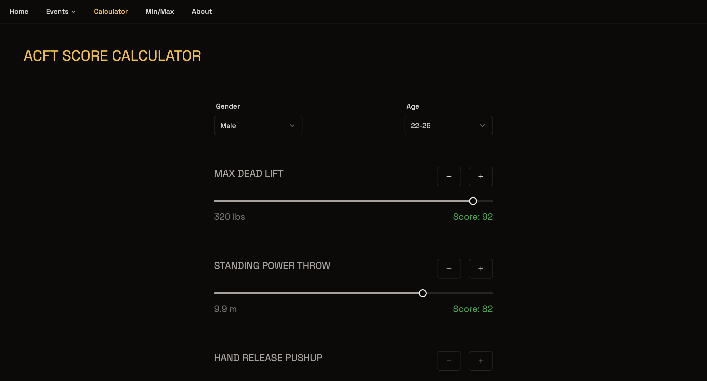

# Army ACFT Calculator

Welcome to the Army ACFT Score Calculator! The Army ACFT Score Calculator can be used to calculate individual scores for the Army Combat Fitness Test.

_Check it out live [here](https://armyacftcalculator.com)!_

 

 
 

 
 

# Why was it created?

Current online ACFT calculators were either full of ads, or were difficult to use on a mobile device. A better solution was needed. The Army ACFT Calculator was created as an ad free, performant application optimized for mobile devices.

Creating this app was also a way to give back to the military community, from one service member to another. 

 
 

# Technologies

The Army ACFT Calculator was built using Next.js and is deployed on Vercel. It uses components from shadcn/ui and is styled with Tailwind CSS.

To ensure proper functionality and accurate score calculations, tests were written for the app using Playwright.

 
 

# Future

A future goal for this project is to include an optional login functionality that would allow users to save scores. The historical scores could then be used to track physical fitness performance over time.

 
 

### Disclaimer

This site has no affiliation with the US Army, and the views and opinions expressed here do not reflect that of the U.S. Army, the Department of Defense or the United States government.